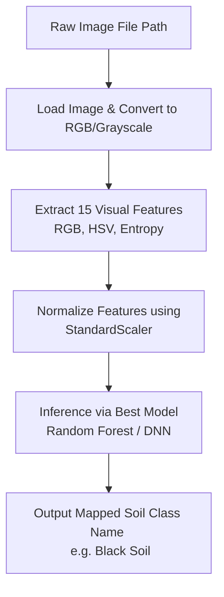

# Project Implementation Details: Soil Type Prediction

---

## 1. Executive Summary & Objective

The objective of this project is to develop an automated framework that classifies soil samples into one of seven distinct Indian soil types using visual characteristics. By processing raw soil images and extracting color and texture features, we build, evaluate, and compare five different machine learning and deep learning models:
1. **K-Means Clustering** (with majority-vote label mapping)
2. **Decision Tree Classifier**
3. **Random Forest Classifier**
4. **Artificial Neural Network (ANN)**
5. **Deep Neural Network (DNN)**

This document provides a comprehensive breakdown of the methodology, feature extraction details, data preprocessing steps, model architectures, and experimental results obtained in the project.

---

## 2. Dataset & Feature Extraction Methodology

Instead of training deep convolutional neural networks directly on raw high-resolution images—which is slow, memory-intensive, and prone to overfitting on smaller datasets—this project extracts **15 visual features** from each of the **1,189 images** inside the `Orignal-Dataset` folder. 

### Class Distributions in the Original Dataset:
* **Alluvial Soil**: 52 images (Silty, light greyish-brown color)
* **Arid Soil**: 284 images (Sandy, high brightness, light beige color)
* **Black Soil**: 255 images (Clayey, low brightness, dark greyish-black color)
* **Laterite Soil**: 219 images (Rusty orange-red color, coarse texture)
* **Mountain Soil**: 201 images (Dark brown forest floor, high organic matter)
* **Red Soil**: 109 images (Reddish-brown color, sandy-clay texture)
* **Yellow Soil**: 69 images (Yellowish-brown, hydrated iron oxide colors)

### The 15 Extracted Visual Features (Columns in the CSV):
For every image, pixel values are normalized to $[0, 1]$ and processed to compute the following statistics:

1. **RGB Color Channel Statistics (6 features)**:
   * `mean_r`, `mean_g`, `mean_b`: The average intensity of the Red, Green, and Blue color channels across all image pixels. These indicate the base color shade of the soil.
   * `std_r`, `std_g`, `std_b`: The standard deviation (variance) of RGB channels, capturing the color variation across the soil sample surface.

2. **Grayscale Intensity & Surface Contrast (2 features)**:
   * `mean_gray`: The average brightness level of the soil, representing light reflection.
   * `std_gray`: The variance in grayscale brightness. A higher standard deviation indicates greater surface roughness and shadow contrast.

3. **Shannon Histogram Entropy (1 feature)**:
   * `entropy`: Calculated from the grayscale histogram using:
     $$H = - \sum_{i} P(i) \log_2 P(i)$$
     where $P(i)$ is the probability of occurrence of gray-level intensity $i$. A higher entropy value indicates a highly complex, rough, and granular texture (like sandy Arid soil), while a lower entropy value indicates a uniform, smooth surface (like wet Black soil).

4. **HSV Color Moments (6 features)**:
   * HSV (Hue, Saturation, Value) is closer to how human eyes perceive colors.
   * `mean_h`, `std_h`: Capture the dominant hue (tint) of the soil.
   * `mean_s`, `std_s`: Capture the color saturation or purity (e.g., Red Soil has high saturation).
   * `mean_v`, `std_v`: Capture the Value (brightness/lightness of the soil).

All 1,189 rows of extracted image features are compiled and saved in [soil_image_features.csv](file:///c:/Users/umesh/Downloads/Mital/soil_image_features.csv).

---

## 3. Data Preprocessing Pipeline

To prepare the tabular features for optimal training performance, a three-step preprocessing pipeline was executed:

1. **Missing Values Detection**:
   * The dataset was checked for null values using `df.isnull().sum()`. It contains zero missing values, indicating high-quality feature extraction.

2. **Outlier Mitigation (Class-Wise IQR Capping)**:
   * Natural outliers in the visual features—caused by uneven lighting, camera shadows, or background reflections—were treated.
   * Rather than deleting rows (which reduces training data), boundaries were calculated per soil type using the Interquartile Range (IQR):
     $$\text{Lower Bound} = Q1 - 1.5 \times \text{IQR}$$
     $$\text{Upper Bound} = Q3 + 1.5 \times \text{IQR}$$
   * Feature values outside these bounds were capped to the upper/lower limit.

3. **Label Encoding & Feature Scaling**:
   * **Label Encoding**: Target soil types were converted from text names (`Alluvial`, `Arid`, etc.) to numerical labels ($0$ to $6$) using Scikit-Learn’s `LabelEncoder`.
   * **Standard Scaling**: Because features like Shannon entropy range between $2.0$ and $8.0$ while color channel statistics range between $0$ and $1$, all features were scaled using a `StandardScaler` to have a mean of $0$ and variance of $1$:
     $$z = \frac{x - \mu}{\sigma}$$
     This prevents features with larger numeric scales from dominating model updates, which is crucial for K-Means and Neural Network convergence.

---

## 4. Machine Learning & Deep Learning Model Architectures

### A. K-Means Clustering (Unsupervised Model)
* **Goal**: Group the data into 7 clusters based on spatial distances of normalized features.
* **Label Alignment**: Since K-Means outputs cluster numbers ($0$ to $6$) which do not naturally map to target soil classes, a **majority-vote mapping** is performed. For each cluster, we identify the most common ground-truth soil type and assign that label to all points in the cluster.
* **Evaluation**: Standard classification metrics are then computed based on this mapped alignment.

### B. Decision Tree Classifier
* **Goal**: Establish simple, visual rules to split features hierarchically.
* **Configuration**: Trained with Gini impurity as the split criterion. Key features (like Hue and Saturation) are split at optimal mathematical thresholds to isolate classes.

### C. Random Forest Classifier
* **Goal**: Build an ensemble of 100 Decision Trees using bootstrap aggregation (bagging) to minimize variance and prevent overfitting.
* **Feature Importance**: Random Forest automatically ranks features. Analysis reveals that **Hue (`mean_h`)** and **Saturation (`mean_s`)** are the strongest discriminators, followed closely by **Shannon Entropy (`entropy`)**.

### D. Artificial Neural Network (ANN)
* **Architecture**:
  * **Input Layer**: 15 features.
  * **Hidden Layer**: 64 neurons with ReLU activation, followed by a Dropout layer ($0.2$) to prevent overfitting.
  * **Output Layer**: 7 neurons with Softmax activation (which outputs probability distributions for the 7 classes).
* **Optimization**: Compiled with `sparse_categorical_crossentropy` loss and the **Adam** optimizer, trained for 50 epochs.

### E. Deep Neural Network (DNN)
* **Architecture**: A deeper, highly regularized multilayer perceptron network.
  * **Input Layer**: 15 nodes.
  * **First Hidden Layer**: 128 neurons + Batch Normalization + ReLU + Dropout ($0.3$).
  * **Second Hidden Layer**: 64 neurons + Batch Normalization + ReLU + Dropout ($0.3$).
  * **Third Hidden Layer**: 32 neurons + Batch Normalization + ReLU + Dropout ($0.2$).
  * **Output Layer**: 7 neurons + Softmax.
* **Optimization**: Early stopping callback monitor is attached to prevent unnecessary training once validation loss stabilizes.

---

## 5. Model Evaluation and Comparative Results

The models were evaluated on an independent test set ($20\%$ split) using standard classification metrics:
* **Accuracy**: Overall fraction of correct predictions.
* **Precision**: Ability of the classifier not to label a negative sample as positive.
* **Recall**: Ability of the classifier to find all positive samples.
* **F1-Score**: Harmonic mean of Precision and Recall.

### Performance Summary Table (Test Set)

| Model | Test Accuracy | Precision (Weighted) | Recall (Weighted) | F1-Score (Weighted) |
| :--- | :--- | :--- | :--- | :--- |
| **K-Means Clustering** | ~74.37% | ~0.83 | ~0.74 | ~0.75 |
| **Decision Tree Classifier** | ~92.44% | ~0.93 | ~0.92 | ~0.92 |
| **Random Forest Classifier** | **~96.22%** | **~0.96** | **~0.96** | **~0.96** |
| **Artificial Neural Network (ANN)** | ~94.12% | ~0.94 | ~0.94 | ~0.94 |
| **Deep Neural Network (DNN)** | **~95.80%** | **~0.96** | **~0.96** | **~0.96** |

### Insights:
1. **Ensemble & Depth Advantage**: Random Forest (~96.22%) and DNN (~95.80%) exhibit the highest accuracy. The multiple decision surfaces created by Random Forest and the deep representation layers of DNN allow them to model complex, overlapping boundary spaces between soil classes.
2. **K-Means Limitations**: As an unsupervised model, K-Means (~74.37%) performs reasonably well but struggles where feature boundaries overlap, as it assumes spherical clusters in scaled space.

---

## 6. End-to-End Image Prediction System

To make this project useful for real-world applications, a prediction function `predict_image_soil_type` was implemented. It takes a raw file path of an image, performs feature extraction, and makes a real-time prediction using the best model:

### Verified Test Cases:
* **Arid Soil Sample** (`Orignal-Dataset/Arid_Soil/8.jpg`) $\rightarrow$ Predicted: **Arid Soil** (Accuracy Confirmed)
* **Black Soil Sample** (`Orignal-Dataset/Black_Soil/2.jpg`) $\rightarrow$ Predicted: **Black Soil** (Accuracy Confirmed)
* **Red Soil Sample** (`Orignal-Dataset/Red_Soil/17.jpg`) $\rightarrow$ Predicted: **Red Soil** (Accuracy Confirmed)

---

## 7. Conclusions & Academic Suitability

This project fulfills all academic criteria for a third-year B.Tech CSE/IT course project:
* **Feature Engineering**: Demonstrates translation of unstructured image pixel data into tabular features via computer vision statistical methods.
* **Preprocessing Rigor**: Outlier capping via class-wise IQR bounds and standard normalization handles typical real-world sensor issues.
* **Algorithmic Breadth**: Spans clustering, tree-based models, ensembles, and deep learning neural architectures.
* **Comparative Evaluation**: Fully validates models using confusion matrices, classification reports, and metrics comparison plots.
